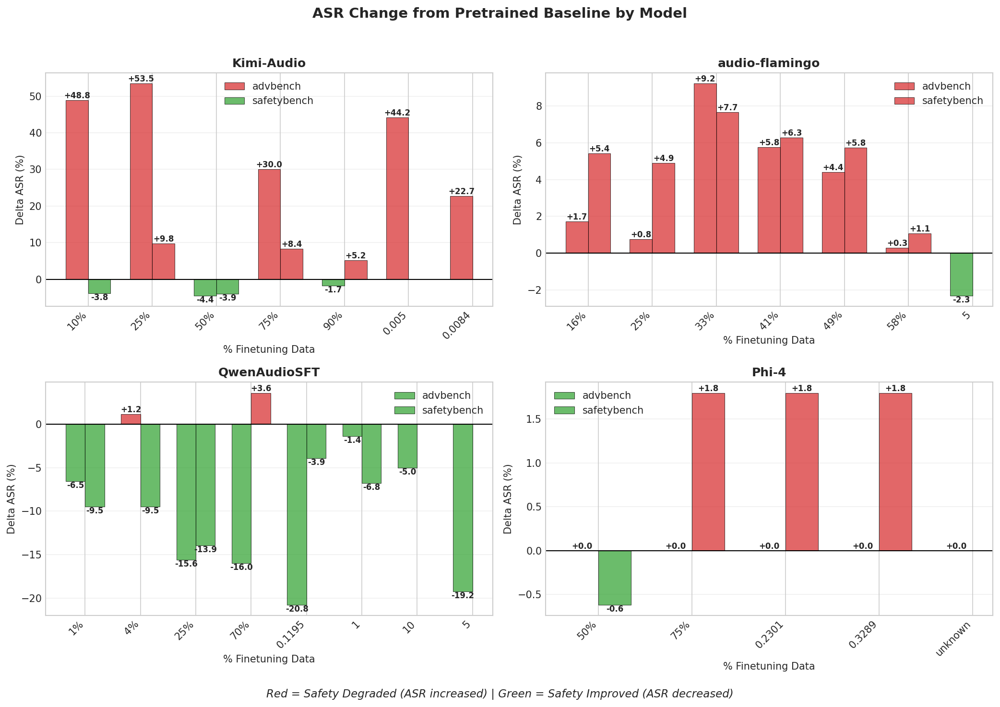
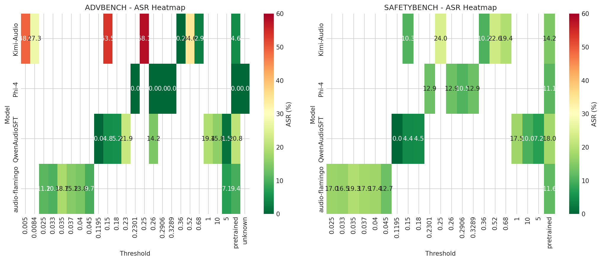

# Audio Benign Finetuning

**Investigating the safety impact of finetuning audio language models on benign data that is semantically similar to harmful content.**

This repository provides tools for:
1. **Filtering** benign audio datasets based on semantic similarity to harmful prompts
2. **Finetuning** audio LLMs (Kimi-Audio, Phi-4, Qwen-Audio, Audio-Flamingo) on filtered data
3. **Evaluating** safety using Attack Success Rate (ASR) and Harmfulness Scores

## Key Finding

Finetuning on benign data that is semantically close to harmful content can **increase model vulnerability** to jailbreaking attacks, even though the training data itself is completely benign.

---

## Table of Contents
- [Method Overview](#method-overview)
- [Installation](#installation)
- [Dataset Filtering](#dataset-filtering)
- [Model Finetuning](#model-finetuning)
- [Safety Evaluation](#safety-evaluation)
- [Results](#results)

---

## Method Overview

### Semantic Similarity Filtering

We filter benign audio samples (from VoiceBench) based on their **semantic embedding distance** to harmful audio prompts (from AdvBench/SafetyBench converted to speech via TTS).

```
┌─────────────────┐     ┌─────────────────┐
│  VoiceBench     │     │  AdvBench/      │
│  (Benign Audio) │     │  SafetyBench    │
│  ~10k samples   │     │  (Harmful TTS)  │
└────────┬────────┘     └────────┬────────┘
         │                       │
         ▼                       ▼
┌─────────────────────────────────────────┐
│     Audio Encoder (Model-Specific)      │
│  - Kimi: GLM-4 Voice Tokenizer          │
│  - Qwen: Whisper Encoder                │
│  - Phi-4: Whisper Encoder               │
│  - Audio-Flamingo: CLAP Encoder         │
└────────────────────┬────────────────────┘
                     │
                     ▼
┌─────────────────────────────────────────┐
│      Cosine Distance Computation        │
│   dist(benign, harmful) for all pairs   │
└────────────────────┬────────────────────┘
                     │
                     ▼
┌─────────────────────────────────────────┐
│     Filter by Distance Threshold        │
│  Keep samples with dist <= threshold    │
│  (closer to harmful = lower distance)   │
└────────────────────┬────────────────────┘
                     │
                     ▼
┌─────────────────────────────────────────┐
│      Filtered Benign Dataset            │
│   For finetuning experiments            │
└─────────────────────────────────────────┘
```

### Why This Matters

- **Lower threshold** = Training data more similar to harmful content
- **Higher threshold** = Training data less similar to harmful content
- We hypothesize that finetuning on data closer to harmful content may inadvertently increase model vulnerability

---

## Installation

### Prerequisites
- Python 3.10+
- CUDA 11.8+ or 12.x
- ~50GB disk space for model weights

### Environment Setup

```bash
# Create conda environment
conda create -n audio_safety python=3.10
conda activate audio_safety

# Install PyTorch (adjust for your CUDA version)
pip install torch==2.1.0 torchvision torchaudio --index-url https://download.pytorch.org/whl/cu118

# Install common dependencies
pip install transformers datasets accelerate peft deepspeed
pip install librosa soundfile tqdm numpy pandas matplotlib

# For evaluation
pip install safe-rlhf  # For harmfulness scoring (optional, we provide custom implementation)
```

---

## Dataset Filtering

### Step 1: Prepare Harmful Audio

Convert text-based harmful prompts to audio using TTS:

```bash
# Using Google TTS (gTTS)
pip install gtts

# Convert AdvBench prompts to audio
python -c "
from gtts import gTTS
import json

with open('advbench_prompts.json') as f:
    prompts = json.load(f)

for i, prompt in enumerate(prompts):
    tts = gTTS(text=prompt, lang='en')
    tts.save(f'advbench_gtts/en/{i:04d}.mp3')
"
```

### Step 2: Filter VoiceBench by Embedding Distance

Each model uses its own audio encoder for embedding extraction:

#### Kimi-Audio (GLM-4 Voice Tokenizer)
```bash
cd Kimi-Audio/finetune_codes

python 0_filter_voicebench_by_embedding.py \
    --harmful_dir /path/to/advbench_gtts/en \
    --threshold 0.15 \
    --use_distance \
    --center \
    --output voicebench_filtered_0.15.jsonl
```

#### Qwen-Audio (Whisper Encoder)
```bash
cd QwenAudioSFT

python 0_filter_qwen.py \
    --harmful_dir /path/to/advbench_gtts/en \
    --percentage 10 \
    --output data/qwen_filtered_voicebench/voicebench_qwen_closest_percentage_10.jsonl
```

#### Phi-4 (Whisper Encoder)
```bash
cd Phi-4

python 0_filter_phi4.py \
    --harmful_dir /path/to/advbench_gtts/en \
    --num_samples 100 \
    --output data/phi4_filtered_voicebench/voicebench_phi4_closest_100.json
```

#### Audio-Flamingo (CLAP Encoder)
```bash
cd audio-flamingo

python 0_filter_closest_to_advbench.py \
    --harmful_dir /path/to/advbench_gtts/en \
    --threshold 0.035 \
    --output data/voicebench_filtered_0.035.json
```

---

## Model Finetuning

### Download Pretrained Models

| Model | HuggingFace | Size |
|-------|-------------|------|
| Kimi-Audio-7B | `moonshotai/Kimi-Audio-7B-Instruct` | ~14GB |
| Qwen-Audio-Chat | `Qwen/Qwen-Audio-Chat` | ~15GB |
| Phi-4-Multimodal | `microsoft/Phi-4-multimodal-instruct` | ~8GB |
| Audio-Flamingo | Custom (see instructions) | ~16GB |

### Finetuning Scripts

#### Kimi-Audio (LoRA)
```bash
cd Kimi-Audio/finetune_codes

# First, prepare the model
python -m model --model_name "moonshotai/Kimi-Audio-7B-Instruct" \
    --output_dir "output/pretrained_kimi_instruct"

# Then finetune with LoRA
bash 3_finetune_lora.sh \
    --data data/voicebench_filtered_0.15_semantic_codes.jsonl \
    --output_dir output/finetuned_lora_0.15
```

**Key Parameters:**
- `--lora_r 16` - LoRA rank
- `--lora_alpha 32` - LoRA alpha
- `--learning_rate 2e-4`
- `--num_train_epochs 3`

#### Qwen-Audio (LoRA + DeepSpeed)
```bash
cd QwenAudioSFT

bash 2_finetune_qwen.sh \
    --percentage 10 \
    --num_epochs 1 \
    --learning_rate 1e-4
```

**Key Parameters:**
- `--use_lora True` - Enable LoRA
- `--deepspeed ds_config_zero2.json` - DeepSpeed ZeRO-2
- `--gradient_accumulation_steps 16`

#### Phi-4 (Full Finetuning)
```bash
cd Phi-4

bash 2_finetune_phi4.sh \
    --num_samples 100 \
    --num_epochs 1 \
    --learning_rate 1e-4
```

**Key Parameters:**
- `--batch_size 4`
- `--gradient_accumulation_steps 2`
- `--no_flash_attention` (if flash-attn not installed)

#### Audio-Flamingo (LoRA)
```bash
cd audio-flamingo

bash 2_finetune_flamingo3.sh \
    --threshold 0.035 \
    --num_epochs 3
```

---

## Safety Evaluation

### Attack Success Rate (ASR)

Uses HarmBench classifier (`cais/HarmBench-Llama-2-13b-cls`) to determine if model responses are harmful.

```bash
# Evaluate single file
python calculate_asr.py \
    --input responses.json \
    --model Phi-4 \
    --dataset advbench

# Batch evaluation
bash run_asr_eval.sh --model Phi-4 --dataset advbench
```

### Harmfulness Score

Uses PKU-Alignment's Beaver Cost Model (`PKU-Alignment/beaver-7b-v1.0-cost`) for continuous harmfulness scoring.

```bash
# Evaluate single file
python calculate_harmfulness.py \
    --input responses.json \
    --model Phi-4 \
    --dataset advbench

# Batch evaluation
bash run_harmfulness_eval.sh --model Phi-4 --dataset advbench
```

**Score Interpretation:**
- **Higher score** = More harmful
- **Lower/negative score** = Safer

---

## Results

### Attack Success Rate by Model and Threshold


**Key Observations:**
- Lower distance thresholds (data closer to harmful) generally increase ASR
- Different models show varying sensitivity to the threshold

### ASR Delta from Pretrained Baseline



Shows the change in ASR compared to pretrained models. Positive values indicate increased vulnerability after finetuning.

### Model Vulnerability Heatmap



### Harmfulness Score Summary

| Model | Threshold | Mean Score | Interpretation |
|-------|-----------|------------|----------------|
| Kimi-Audio | pretrained | -13.62 | Baseline (safe) |
| Kimi-Audio | 0.68 | -13.91 | Similar to baseline |
| Kimi-Audio | 0.36 | -14.74 | Similar to baseline |
| Kimi-Audio | 0.25 | 14.79 | Less safe |
| Kimi-Audio | 0.15 | 25.27 | Most harmful |

**Finding:** Lower distance threshold (data closer to harmful) = Higher harmfulness scores. Finetuning on the closest 15% of benign data increased harmfulness by ~39 points compared to pretrained.

---

## Repository Structure

```
audio_benign_finetuning/
├── calculate_asr.py              # ASR evaluation using HarmBench
├── calculate_harmfulness.py      # Harmfulness scoring using PKU-Alignment
├── run_asr_eval.sh              # Batch ASR evaluation
├── run_harmfulness_eval.sh      # Batch harmfulness evaluation
├── finetuning_codes/            # Finetuning scripts for all models
│   ├── kimi_audio/              # Kimi-Audio-7B finetuning
│   │   ├── 0_filter_voicebench_by_embedding.py
│   │   ├── 3_finetune_lora.py
│   │   ├── 3_finetune_lora.sh
│   │   ├── 5_merge_lora_for_inference.py
│   │   └── 6_evaluate_harmful_audio.py
│   ├── phi4/                    # Phi-4 Multimodal finetuning
│   │   ├── 0_filter_phi4.py
│   │   ├── 1_prepare_phi4_dataset.py
│   │   ├── 2_finetune_phi4.py
│   │   └── 3_evaluate.py
│   ├── qwen_audio/              # Qwen-Audio finetuning
│   │   ├── 0_filter_qwen.py
│   │   ├── 1_prepare_qwen_dataset.py
│   │   ├── 2_finetune_qwen.py
│   │   └── ds_config_zero2.json
│   └── audio_flamingo/          # Audio-Flamingo finetuning
│       ├── 0_filter_closest_to_advbench.py
│       ├── 1_prepare_filtered_dataset.py
│       ├── 2_finetune_audio_flamingo.py
│       └── 3_evaluate_jailbreaking.py
├── asr_results/                 # ASR evaluation results
│   ├── *.png                    # Visualization plots
│   └── {model}/                 # Per-model JSON results
└── harmfulness_results/         # Harmfulness score results
    └── {model}/                 # Per-model JSON results
```

---

## Citation

If you use this code, please cite:

```bibtex
@misc{audio_benign_finetuning,
  title={Investigating Safety Degradation from Benign Audio Finetuning},
  author={Jaechul Roh},
  year={2025},
  url={https://github.com/jrohsc/audio_benign_finetuning}
}
```

## License

This project is for research purposes only. Please ensure compliance with the licenses of the underlying models:
- Kimi-Audio: [Moonshot License](https://huggingface.co/moonshotai/Kimi-Audio-7B-Instruct)
- Qwen-Audio: [Tongyi Qianwen License](https://huggingface.co/Qwen/Qwen-Audio-Chat)
- Phi-4: [Microsoft License](https://huggingface.co/microsoft/Phi-4-multimodal-instruct)
- HarmBench Classifier: [CAIS License](https://huggingface.co/cais/HarmBench-Llama-2-13b-cls)
- PKU-Alignment Cost Model: [PKU License](https://huggingface.co/PKU-Alignment/beaver-7b-v1.0-cost)
